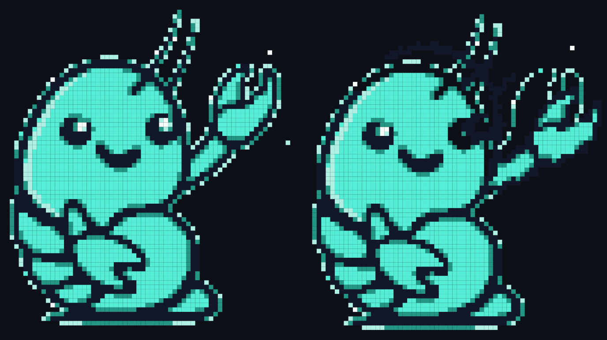

# 🦐 clawtime

The **nanoclaw** shrimp, waving hello right in your terminal — a faithful,
pixel-perfect rendering of the mascot that **waves its claw**, gently floats,
blinks, and blows a few bubbles. Smooth, flicker-free, focus-aware, and
auto-centered, with basically no CPU when you're not looking.



*(two frames of the loop — the claw swings between them)*

Inspired by [ghosttime](https://github.com/SohelIslamImran/ghosttime); the
terminal engine is derived from it.

## Run it

```bash
# no install
npx clawtime

# or install globally
npm install -g clawtime
clawtime
```

Press `q` or `Ctrl+C` to exit. A terminal with 24-bit ("truecolor") support
shows the mascot best — that's most modern terminals (Ghostty, iTerm2, Kitty,
WezTerm, VS Code…).

## Options

| Flag | Description |
| --- | --- |
| `-c, --color <name\|#hex\|r,g,b>` | Recolor the body (e.g. `-c pink`, `-c '#ff66cc'`, `-c 255,120,180`). Default is nanoclaw teal. |
| `--select-color` | Pick a color interactively. |
| `--colors` | List the available color names. |
| `-t, --timer <seconds>` | Run for a set duration, then exit. |
| `-nf, --no-focus-pause` | Keep animating even when the terminal loses focus. |
| `-h, --help` | Show help. |

```bash
clawtime -c cyan        # a cyan shrimp
clawtime -c '#ff9ecb'   # any hex color
clawtime -t 10          # wave for 10 seconds
clawtime -nf            # never pause
```

## How it works

Like [ghosttime](https://github.com/SohelIslamImran/ghosttime), the animation is
a set of pre-rendered frames plus a few ANSI/DEC escape-sequence tricks:

- **Time-based frame clock.** The current frame is derived from elapsed wall time
  (~33 fps), so playback self-corrects and only redraws on change — idle CPU
  stays near zero.
- **Flicker-free rendering.** It probes for DEC mode 2026 (synchronized output)
  and paints each frame atomically when supported, otherwise falls back to a
  cursor-home line-by-line overwrite.
- **Focus-aware pause.** Enables focus reporting (`?1004`) and pauses/resumes
  when you switch away — disable with `-nf`.
- **Good terminal citizen.** Alternate screen buffer, hidden cursor,
  auto-centering, full restore on exit. Zero runtime dependencies.

### The art

The mascot is the **actual nanoclaw logo**, not a hand-drawn approximation:

1. `scripts/rasterize.mjs` rasterizes the official SVG
   (`assets/nanoclaw-light-square.svg`), crops it to the mascot, downsamples to a
   ~64-wide grid, flood-fills the white background to transparency (so the eye
   catchlights survive), and quantizes to the mascot's palette. It **splits the
   sprite into two layers** — the body and the *raised arm* (SVG path #15, plus
   the navy backing hugging it) — and records the shoulder pivot →
   `scripts/base-sprite.json`.
2. `scripts/generate.mjs` builds a seamless loop where the **arm rotates about
   the shoulder to wave** (the body stays put), plus a gentle float-bob, an
   occasional blink, and rising bubbles. Each frame is the body with the rotated
   arm composited on top → `src/animation-data.ts`.
3. At runtime, `src/animation.ts` packs each pair of pixel rows into one line of
   text using the half-block `▀` (foreground = top pixel, background = bottom
   pixel), doubling vertical resolution and reproducing the mascot in 24-bit
   color. `-c` simply swaps the body color; the outline, eyes, and shading keep
   theirs.

## Develop

```bash
npm run dev            # run from source (needs bun)
npm run gen            # rebuild src/animation-data.ts (animation) from base-sprite.json
npm run raster         # rebuild scripts/base-sprite.json from the SVG (macOS; needs qlmanage + sips)
npm run build          # bundle src/cli.ts -> dist/cli.js (needs bun)

# preview the art as a pixel grid (writes HTML you can open):
node scripts/generate.mjs --pixels 0 > frame0.html   # a single frame
node scripts/generate.mjs --hero      > hero.html     # waving + blink, side by side
```

## Credits

- Terminal engine adapted from **ghosttime** by
  [Sohel Islam Imran](https://github.com/SohelIslamImran/ghosttime) (MIT).
- Mascot artwork: the **nanoclaw** shrimp ([nanoclaw.dev](https://nanoclaw.dev)).

## License

[MIT](./LICENSE)
